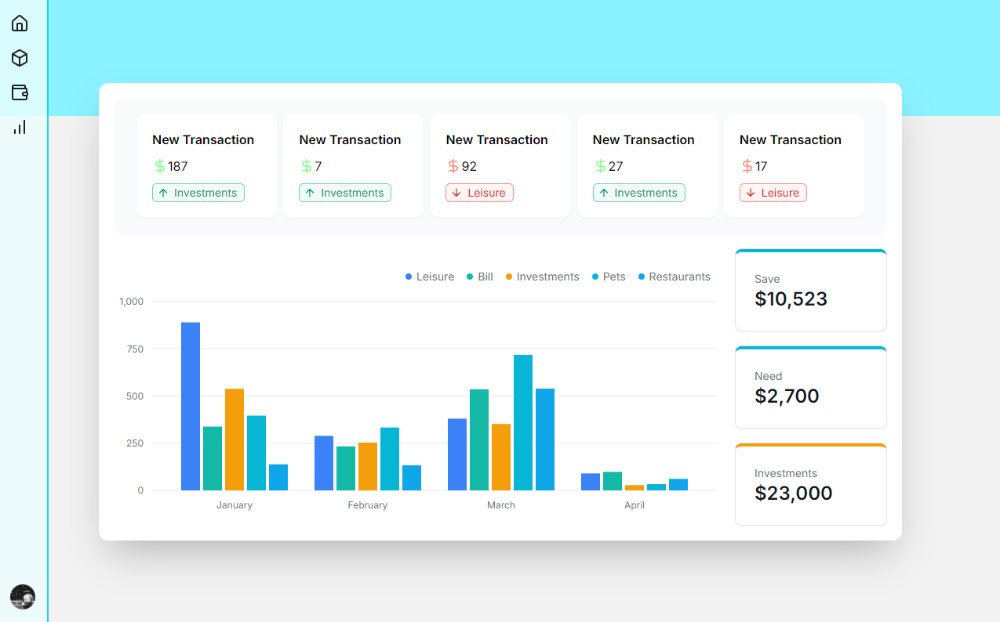
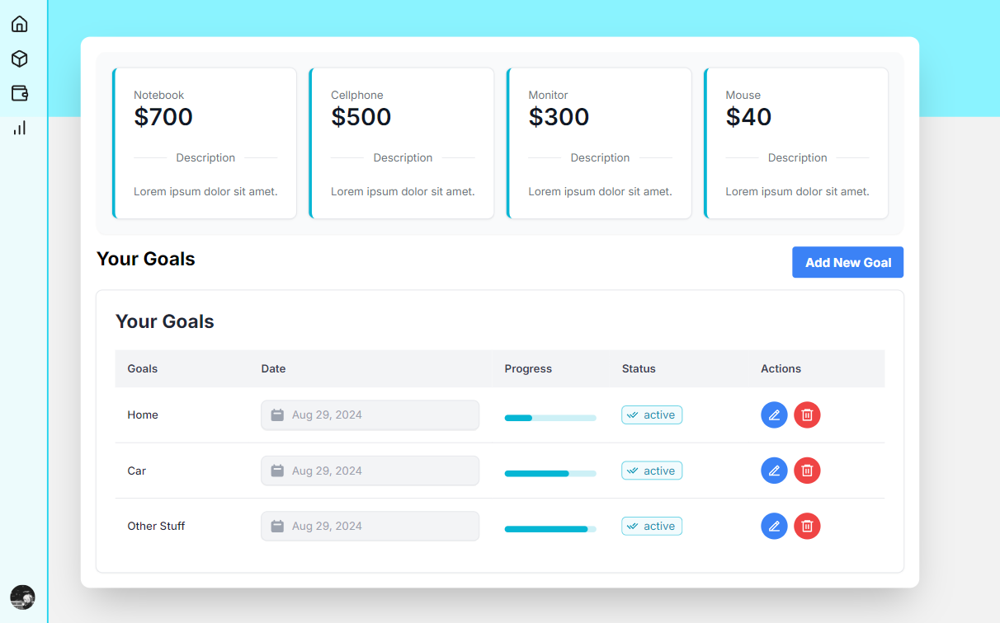
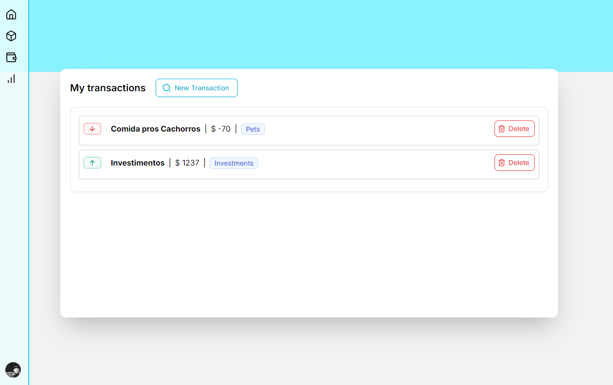

# Dashboard para gerenciamento de gastos

Como usar a aplicação?

```bash
git init
git clone https://github.com/imneli/the-dashboard.git
npm i
npm run dev
```

## Home



## Goals



## Wallet



<hr>
<div align="center">
  <h1>The Dashboard</h1>
</div>


